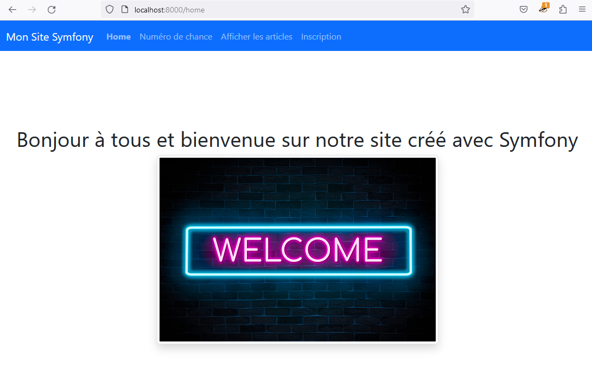

# TP 5 - Introduction au framework Symfony

## Modifications

Les modifications apportées sont les suivantes :
- Passage à PHP8
- Utilisation des attributs PHP (#[]) pour les directives de l'ORM
- Passage à Bootstrap 5.3
- Utilisation de 'cards' Bootstrap pour afficher la liste des articles
- Création de la page enregistrement en utilisant le module 'registration-form' et utilisation de Bootstrap

## Captures d'écran 

